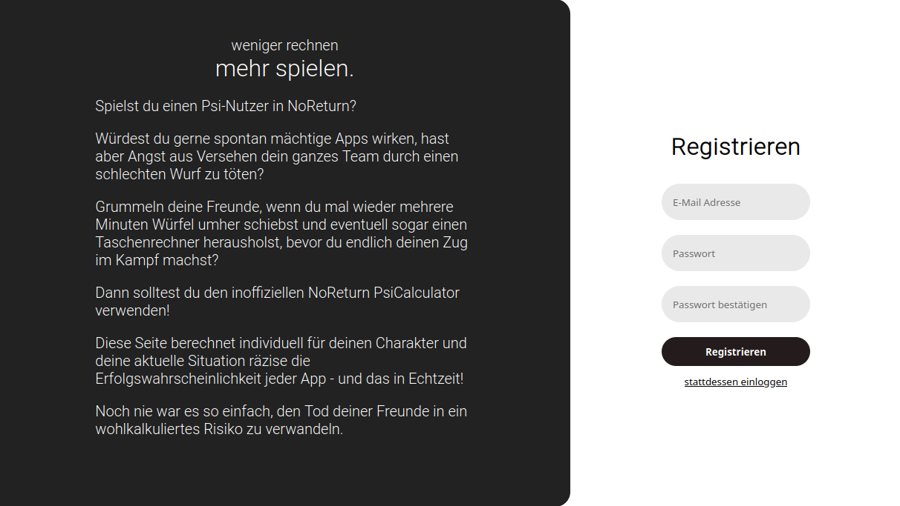

# About
This project contains my latest attempt at creating a sort of companion app for [NoReturn](https://www.mannifest-games.com/games/noreturn/), a German pen&paper RPG system designed by [Mannifest Games](https://www.patreon.com/MannifestGames). In this game, a group of players create characters to embark on adventures in a post-apocalyptic setting, where they face many different challenges.

One way characters can overcome these challenges is by using so-called PSI-Apps. Essentially, these apps map to magic spells in a more traditional setting. Each app belongs to a certain power group ("Kraftgruppe") such as telekinesis or psychokinesis, which might correspond to different schools of magic. To use an app, a player must roll a number of 6-sided dice and get a total result inside of a specific target range, otherwise the app will fail (with potentially deadly results). The number of dice they may roll depends on certain statistics, such as the wisdom value of the character and their level of mastery of the app's power group. Instead of using all dice for rolling inside this target group, players may invest some of them to make the app more powerful, for example by increasing its range or duration. To further complicate matters, players may also sacrifice a certain number of dice to increase the size of the roll's target range.

While some players may enjoy manual probabilistic calculations in the heat of battle, that is not always the case. Especially the other players will often complain about psi users taking a long time on their turn to decide on their optimal course of action. This is where this companion app comes in: it allows psi users to quickly **view all available apps** and their individual **chances of success**. It also has some other neat features, which you are invited to discover yourself.

# Screenshots

